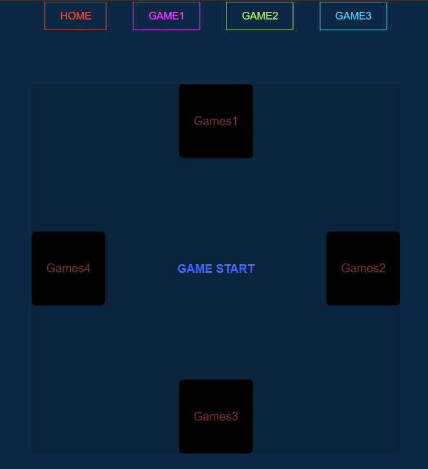

# games

## Project setup
```
$ git clone https://github.com/Caococos/games.git

$ npm install
```

### Compiles and hot-reloads for development
```
npm run serve
```

### Functional features
* 1.点击GAME START开始转动游戏盘，随机跳转到一款游戏界面中。
  * 

